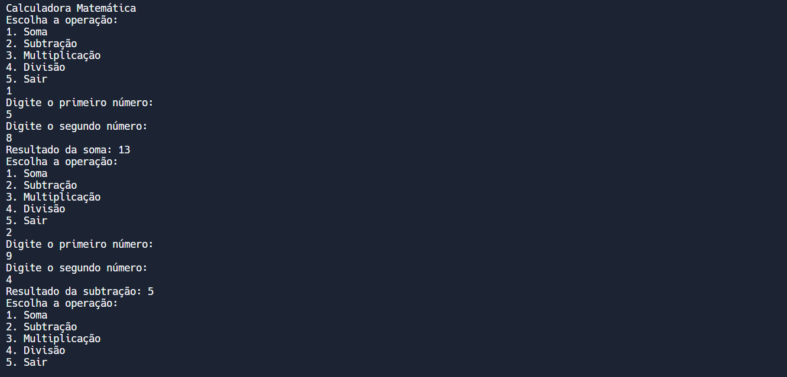
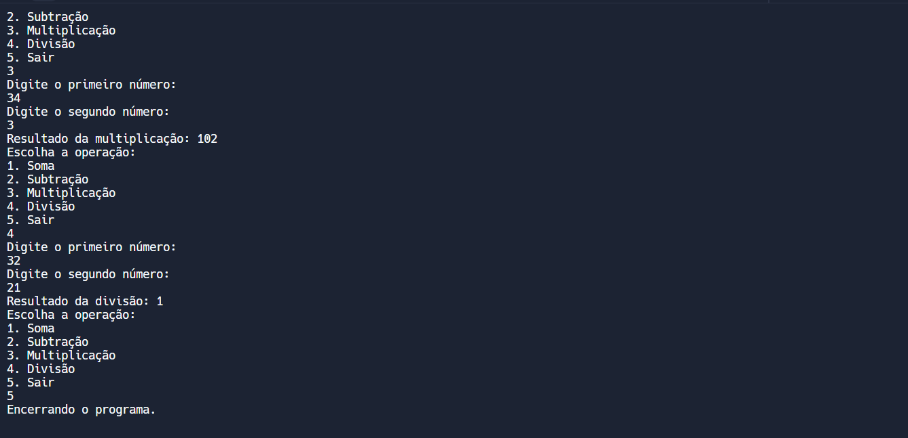

# CALCULADORA DE MATEMATICA
👨‍🏫A CALCULADORA PERMITE QUE O USUÁRIO REALIZE OPERAÇÕES MATEMÁTICAS BÁSICAS COMO SOMA, SUBTRAÇÃO, MULTIPLICAÇÃO E DIVISÃO ENTRE DOIS NÚMEROS INTEIROS.

 <br>
 <br>

## DESCRIÇÃO:
Este projeto consiste em uma calculadora matemática simples implementada em Rust. A calculadora permite que o usuário realize operações matemáticas básicas como soma, subtração, multiplicação e divisão entre dois números inteiros. O programa é executado no terminal, onde o usuário interage selecionando a operação desejada e fornecendo os números para calcular.

## FUNCIONALIDADES:
1. **Soma**: Adiciona dois números inteiros e exibe o resultado.
2. **Subtração**: Subtrai o segundo número do primeiro e exibe o resultado.
3. **Multiplicação**: Multiplica dois números inteiros e exibe o resultado.
4. **Divisão**: Divide o primeiro número pelo segundo (se o segundo número não for zero) e exibe o resultado.
5. **Encerramento**: Permite ao usuário sair do programa.

## COMO USAR?
1. **Execução do Projeto:**
   - Para iniciar o aplicativo, navegue até o Diretório `./CODIGO`, e digite o seguinte comando no Terminal:
     ```bash
     cargo run
     ```
     
2. **Interagindo com Aplicativo:**
   1. **Execução do Programa**:
      - O programa é executado em um ambiente de terminal (linha de comando).

   2. **Menu de Opções**:
      - Ao iniciar o programa, um menu é exibido com as seguintes opções:
      ```
      Calculadora Matemática
      1. Soma
      2. Subtração
      3. Multiplicação
      4. Divisão
      5. Sair
      ```
      
   3. **Escolha da Operação**:
      - O usuário seleciona uma das opções digitando o número correspondente seguido da tecla Enter.

   4. **Entrada de Números**:
      - Após selecionar a operação, o programa solicita que o usuário insira dois números inteiros.
      - Os números são digitados na linha de comando e confirmados com a tecla Enter.

   5. **Resultado da Operação**:
      - Após inserir os números, o programa realiza a operação escolhida e exibe o resultado na tela.
      - Caso a operação seja a divisão e o segundo número seja zero, o programa exibirá um erro de divisão por zero.

   6. **Finalização do Programa**:
      - O usuário pode repetir as operações ou escolher a opção "Sair" para encerrar o programa.

## NÃO SABE?
- Entendemos que para manipular arquivos em muitas linguagens e tecnologias, é necessário possuir conhecimento nessas áreas. Para auxiliar nesse aprendizado, oferecemos cursos gratuitos disponíveis:
* [CURSO DE RUST](https://github.com/VILHALVA/CURSO-DE-RUST)
* [CONFIRA MAIS CURSOS](https://github.com/VILHALVA?tab=repositories&q=+topic:CURSO)

## CREDITOS:
- [PROJETO CRIADO PELO VILHALVA](https://github.com/VILHALVA)


